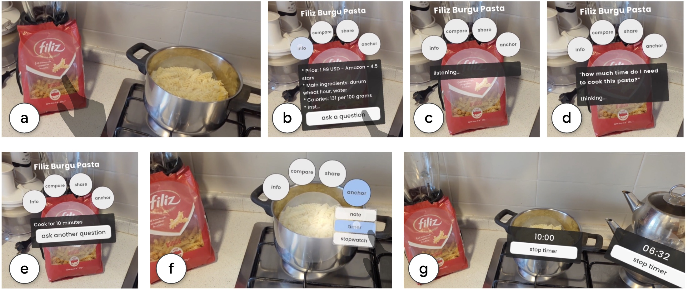

# XR-Objects: Augmented Interaction for Analog Objects

XR-Objects is an implementation of Augmented Object Intelligence (AOI) as described in our [ACM UIST'24](https://uist.acm.org/2024/) paper: 

<sub>Mustafa Doga Dogan, Eric J. Gonzalez, Karan Ahuja, Ruofei Du, Andrea Colaço, Johnny Lee, Mar Gonzalez-Franco, and David Kim. 2024. Augmented Object Intelligence with XR-Objects. In The 37th Annual ACM Symposium on User Interface Software and Technology (UIST ’24), October 13–16, 2024, Pittsburgh, PA, USA. ACM, New York, NY, USA, 15 pages. https://doi.org/10.1145/3654777.3676379 </sub>

This repository contains the Unity project files for the XR-Objects project, which includes an implementation for automatically generating and anchoring actionable context menus for real-world objects in mixed reality (XR), i.e., specifically augmented reality (AR) interactions.



The repository contains the Unity project files for the Android implementation and is based on [ARCore](https://developers.google.com/ar/develop/unity-arf/getting-started-ar-foundation) and [MediaPipe](https://developers.google.com/mediapipe/solutions/vision/object_detector) for real-time object detection and spatial interaction.

It also contains a project template that can be used as a basis to implement XR-Objects on XR headsets, such as Quest 3, or Vision Pro.

## What is XR-Objects and what does it enable?

Existing techniques for interacting with real-world objects in mixed reality (XR) require pre-registration, device instrumentation, or marker-based augmentation of the physical world. This challenge is compounded by the task of blending physical objects and related digital content meaningfully in augmented reality (AR). 

To address these issues, we propose XR-Objects, a novel interaction paradigm and design space for object-centric interactions using auto-generated AR context menus. These context menus provide a familiar interface for users to take further actions with analog real-world objects (i.e., non-electronic and instrumentation-free objects) in a contextual and spatial manner, similar to "right-clicking" files on a computer to access their context menu.

We leverage Gemini, a multimodal large language model (LLM) to retrieve metadata about the objects, even without prior knowledge of the objects present. This facilitates fluid interactions among multiple objects and enables users to take various actions, such as querying real-time information, asking questions, adding spatial notes, or sharing the objects with contacts.


## Getting started

### How to build and run the XR-Objects Android project

1. Pull/clone the repo.
2. Open the "ARCoreMP" directory as a project in Unity Hub. This directory contains the project files for the Android implementation.
   Install the necessary Unity version as needed, as instructed by Unity Hub.
3. Important: If not already set to Android, set the target platform to Android in the Unity project's Build Settings.
   The other relevant project settings should already be selected, but you can verify that IL2CPP is selected as the Scripting Backend, and Android 7.0 (API level 24) as the Minimum API Level. For Target Architectures, both ARMv7 and ARM64 are selected.
4. Open the scene "SceneXRObjects" located in `Assets/XRObjects/`.
   In Build Settings, ensure that only this scene is selected for "Scenes In Build".
   Note: In case you get an error saying `Multiple precomplies assemblies with the same name Google.Protobuf.dll` - please delete one of the `Google.Protobuf.dll files, for example the one in the folder `/Editor/Scripts/Internal/Analytics`.
5. Get a Gemini API key from [the Gemini developer page](https://aistudio.google.com/app/apikey), and enter this key for the `apiKey` variable in the `ImageQuery.cs` script located in `Assets/XRObjects/Scripts/`.
6. Build and Run the app for Android as the platform.
7. On the phone, ensure that WiFi is on, and camera and location access are given.
8. Click the buttons in the UI menu below: First "(1)" and then "(2)" so the object detection starts working.
9. Once an object has been identified, it will automatically be marked. The user can then tap the object to reveal its context menu. Once the desired objects are identified, it is possible to tap the "(2)" button to turn off object detector that runs in the background. This allows the system to run faster, while still allowing the user to interact with the objects previously identified in the scene.

#### Current capabilities of the XR-Objects Android app 


Our system, based on MediaPipe's object classifier built on the MS COCO dataset, currently allows interacting with objects of the following classes: bottle, cup, bowl, cell phone, laptop, mouse, vase, plant, apple, orange, backpack, handbag. More classes, as listed in the object detector's [labelmap](https://storage.googleapis.com/mediapipe-tasks/object_detector/labelmap.txt) can be enabled by adjusting the specific object list `allowedObjectLabels` in `ARCursor.cs`, or by editing from the Unity Editor (attached to the "AR Cursor" object).


Every object's context menu contains a variety of digital actions that the user can take. The digital actions that are fully implemented are as follows: (1) get information summary about the object, (2) ask custom questions, (3) anchor note, (4) anchor countdown timer, (5) anchor stopwatch, (6) compare all visual features in the scene and ask follow-up questions, (7) compare all identified objects in the scene and ask follow-up questions. Developers can add more actions in the Unity project and share them with the research community.


### How to build and run the XR headset (Quest 3) project

We note that the headset implementation is not fully complete, however, we provide the code base as a basis for future development of XR-Objects. Because the camera stream cannot be accessed by developers on Quest, we plug in an external webcam to the headset, and run the object detector on this stream. For future development, a calibration of this webcam's axis and the headset's axis will be needed. The Unity project in the "DemoHeadset" demonstrates how an external camera stream can be used on a headset to execute on-device real-world object identification. This feature is based on UVC4UnityAndroid. Because the project template was built using OpenXR, it is compatible with a variety of headsets. However, for certain features such as real-time depth sensing, a native toolkit, such as Meta SDK, might be needed. Developers might consider using such toolkits in future development.

1. Pull/clone the repo.
2. Open the "DemoHeadset" directory as a project in Unity Hub. This directory contains the project files for the headset implementation.
   Install the necessary Unity version as needed, as instructed by Unity Hub.
3. Important: If not already set to Android, set the target platform to Android in the Unity project's Build Settings.
   The other relevant project settings should already be selected, but you can verify that IL2CPP is selected as the Scripting Backend, and Android 7.0 (API level 24) as the Minimum API Level. For Target Architectures, ARM64 is selected.
4. Open the scene "SceneDemoHeadset" located in `Assets/XRObjects/SceneDemoHeadset/`.
   In Build Settings, ensure that only this scene is selected for "Scenes In Build".
5. In case you get an error saying `Multiple precomplies assemblies with the same name Google.Protobuf.dll` - please delete one of the Google.Protobuf.dll files, for example the one in the folder `/Editor/Scripts/Internal/Analytics`.
6. Build and Run the app for Android as the platform.
7. Once built, locate the compiled APK file on the computer.
   Using Terminal, install this APK on the connected headset using the command `adb install -r -d -g name_of_the_file.apk`. This command ensures the app has the correct permissions to utilize the webcam.
8. Plug in the external webcam to the headset. A permission popup will appear, please give camera access to the headset.
9. You will see the webcam stream, which will have bounding boxes around the identified objects.


## Cite

If you use this software, please cite the following paper:

```bibtex
@inproceedings{Dogan_2024_XRObjects,
	address = {New York, NY, USA},
	title = {Augmented Object Intelligence with XR-Objects},
	isbn = {979-8-4007-0628-8/24/10},
	url = {https://doi.org/10.1145/3654777.3676379},
	doi = {10.1145/3654777.3676379},
	language = {en},
	booktitle = {Proceedings of the 37th {Annual} {ACM} {Symposium} on {User} {Interface} {Software} and {Technology}},
	publisher = {Association for Computing Machinery},
	author = {Dogan, Mustafa Doga and Gonzalez, Eric J and Ahuja, Karan and Du, Ruofei and Colaco, Andrea and Lee, Johnny and Gonzalez-Franco, Mar and Kim, David},
	month = oct,
	year = {2024},
}
```

## Additional information

You may use this software under the
[MIT](https://github.com/google/xr-objects/blob/main/LICENSE) License.

This project contains open-sourced components, including MediaPipe Unity Plugin (homuler, 2021), Unity Android Speech Recognizer plugin (Eric Batlle Clavero, 2020), Unity Radial Layout Group by Just a Pixel (Danny Goodayle, 2015), UVC4UnityAndroid by (saki4510t, 2022), as well as fonts with Open Font Licenses (OFL), such as LiberationSans, Manrope, and Poppins. The individual license files can be found under the /third_party directory.
